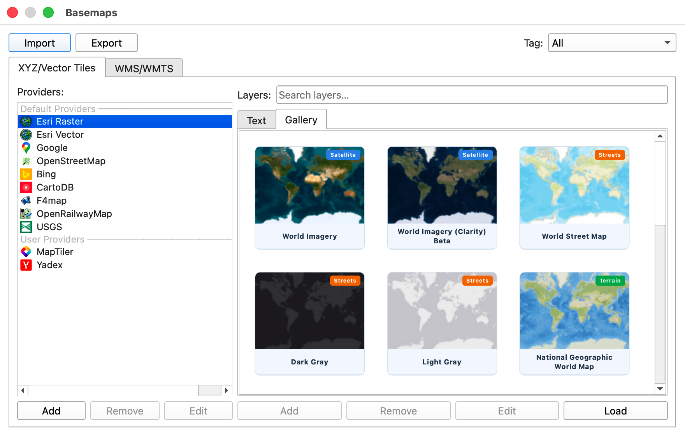
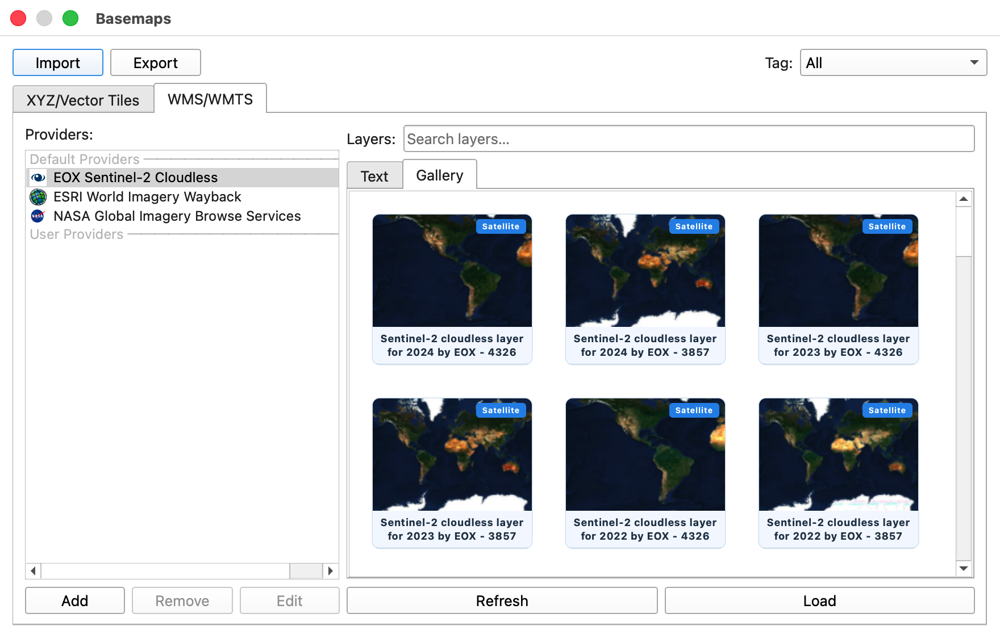

# Basemaps (Plugin for QGIS)

A QGIS plugin with 12 providers and 1500+ basemaps — XYZ tiles, vector tiles, WMS, and WMTS — in 12 languages. Just click and load.

## Features

- **12 providers with 1500+ basemaps** — XYZ tiles, Vector tiles, WMS, and WMTS, including Esri, Google Maps, Bing Maps, OpenStreetMap, Sentinel-2 Cloudless, NASA, USGS, and more.
- **QGIS 3.x and 4.x** compatible.
- **12 languages**: English, 中文, 日本語, 한국어, Français, Deutsch, Русский, العربية, Español, Português, हिन्दी, বাংলা.
- **Add, edit, remove**, and **import/export** custom basemaps — share configs with colleagues or back up your settings.
- **Clean and fast** — carefully crafted to keep the interface intuitive and loading responsive for a seamless experience.

## Installation

### Via QGIS Plugin Manager (Recommended)
1. Open QGIS.
2. Go to `Plugins` -> `Manage and Install Plugins...`.
3. Select the `All` tab.
4. Search for `Basemaps`.
5. Click `Install Plugin`.

### Manual Installation
1. Download the source code.
2. Extract the folder to your QGIS plugins directory:
   - **Windows**: `%APPDATA%\QGIS\QGIS3\profiles\default\python\plugins\`
   - **macOS**: `~/Library/Application Support/QGIS/QGIS3/profiles/default/python/plugins/`
   - **Linux**: `~/.local/share/QGIS/QGIS3/profiles/default/python/plugins/`

## Usage

1. **Open the Plugin** either by: 
   - Click the **Basemaps** icon  in the toolbar 
   - or go to `Plugins` -> `Basemap Management` -> `Load Basemaps`.
2. **Load Basemaps**: 
   1. Browse and select a provider in `XYZ Tiles` or `WMS/WMTS` tab
   2. Select the desired Basemaps or Layers (hold `Shift` or `Ctrl`/`Command` to select multiple), then click `Load` to add them to your project.
3. **Manage Providers**:
   - **Add**: Click the `Add` button to add a new custom provider.
   - **Edit**: Right-click on a user-defined provider to edit it.
   - **Remove**: Click the `Remove` button to remove it.
   - **Duplicated as user provider**: Right-click on a default provider, then click `Duplicated as user provider` to duplicate it as a user provider. Then, you can edit the duplicated provider.
4. **Import/Export**: 
   - **Import**: Click the `Import` button to import a custom provider.
   - **Export**: Click the `Export` button to export a custom provider.

## Screenshots

- **XYZ/Vector Services:**

- **WMS/WMTS Services:**

## Contributing

Contributions are welcome! If you have any ideas or suggestions, please feel free to:

- [open issues](https://github.com/Fanchengyan/Basemaps/issues)
- [submit pull requests](https://github.com/Fanchengyan/Basemaps/pulls)
- share other basemap services on [Discussions](https://github.com/Fanchengyan/Basemaps/discussions)
