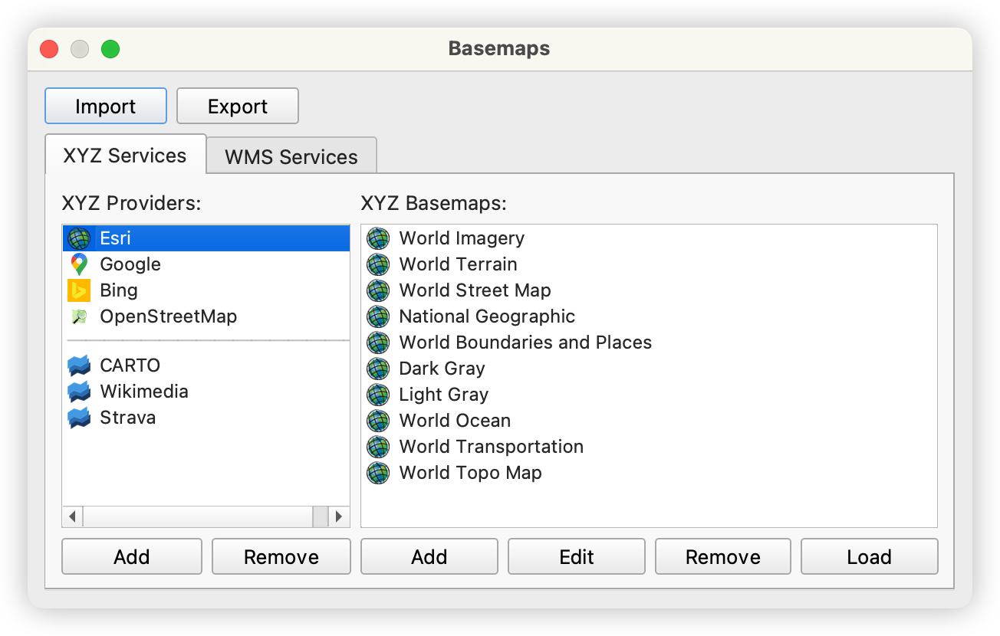

# Basemaps (Plugin for QGIS)

A QGIS plugin that provides easy access to multiple well-known online basemap services, supporting XYZ tiles, WMS, and WMTS services.

## Features

- **Pre-integrated Popular Basemap Providers**: Includes well-known basemaps such as `Sentinel-2 Cloudless`, `ESRI`, `Google Maps`, `Bing Maps`, `OpenStreetMap`, and more.

- **Intuitive Basemap Management Interface**: Easily add/remove basemaps and import/export configurations with a user-friendly interface.

## Screenshots

- **XYZ Services:**

- **WMS Services:**

## Contributing

Contributions are welcome! If you have any ideas or suggestions, please feel free to:

- [open issues](https://github.com/Fanchengyan/Basemaps/issues)
- [submit pull requests](https://github.com/Fanchengyan/Basemaps/pulls)
- share other basemap services on [Discussions](https://github.com/Fanchengyan/Basemaps/discussions)

